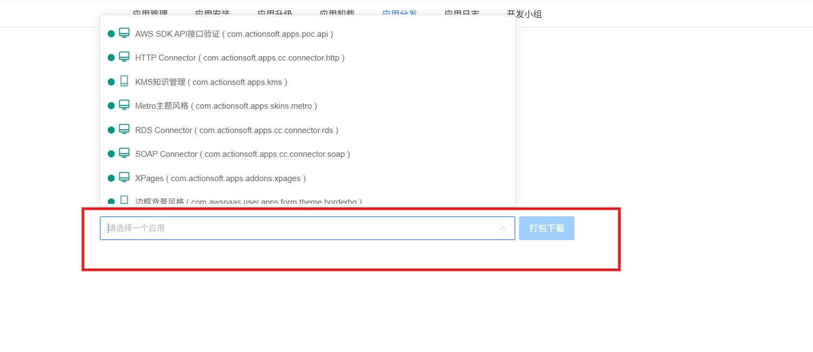
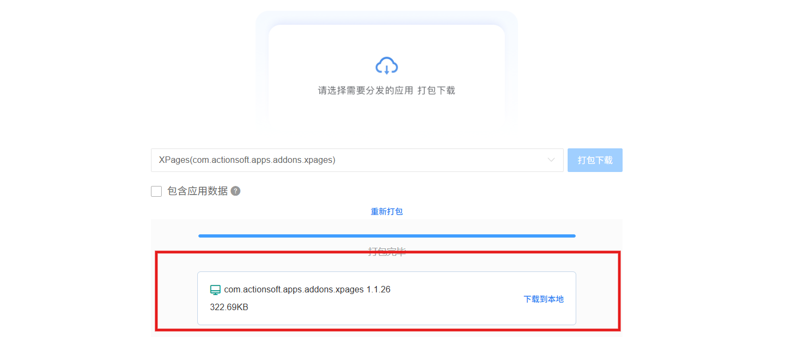

# 应用开发管理需求

> 来源：skills/应用开发/SKILL.md + SKILL-应用管理.md（两文件内容相同，合并去重）

## 概述
应用开发.应用分发台账对于应用界面设计如图参考：


## 应用分发

应用分发用于分发打包应用，在所有资源打包分发成一个***.sap的压缩包，包括应用对应所有资源，但不包含src源码

### 应用分发操作

**操作**：
- 打开应用分发页面，选择一个应用，如图所示：


- 点击打包后，显示打包进度，然后提供下载，如图所示：


- 分发的应用比当前应用版本小版本自动升级一个版本，只要是在manifest.xml中体现，后续应用安装的时候也是从这读取版本号，然后和当前版本做对比，做到版本管理的目的

    顶部标题区

    标题文字：“请选择需要分发的应用打包下载”

    应用列表/选项区

    显示一个应用项：XPages(com.actionsoft.apps.addons.xpages)

    右侧对应一个按钮：“打包下载”

    打包选项与操作区

    包含一个复选框：“包含应用数据”

    一个操作按钮：“重新打包”

    打包完成提示/结果区

    显示状态：“打包完毕”

    显示应用标识与版本：com.actionsoft.apps.addons.xpages1.1.26

    右侧显示文件大小：322.69KB

    对应操作按钮：“下载到本地”

    整体布局为垂直排列的功能型界面，从上到下依次为：引导说明 → 选择应用并触发打包 → 设置打包选项 → 打包结果展示与下载。

```
apps/install/{appId}/
├── pom.xml              # parent = yuncode-lowcode-boot
├── manifest.xml         # 应用描述信息（参考模板）
├── icon.png             # 应用图标
├── lib/                 # 私有依赖 JAR
├── repository/          # 数据库表、表单、台账、定时任务、流程
├── template/            # 扩展 Controller 页面模板
└── web/                 # 静态资源（HTML/CSS/JS）
```

目录管理：
- `apps/install/` — 新建和上传的应用
- `apps/uninstall/` — 卸载的应用归档
- `apps/history/` — 历史版本归档

**应用列表**：
- 表头：应用名、信息、时间、运行状态
