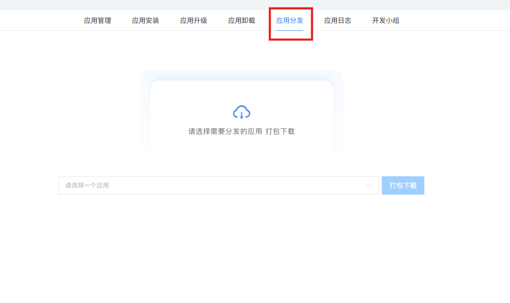

# 应用开发管理需求

> 来源：skills/应用开发/SKILL.md + SKILL-应用管理.md（两文件内容相同，合并去重）

## 概述
应用部署.应用分发台账对于应用界面设计如图参考：


## 应用部署

应用部署用于上传开发的应用包***.sap

### 应用部署

**布局**：
1. 顶部标题区
主标题：“本地App上传”使用深灰（#1F2937），24px，字重600，左侧配有一枚简约的上传图标（云+向上箭头），图标采用品牌渐变（蓝→青），与文字形成视觉锚点。

副标题/描述（可选）：一行小字“上传并管理企业内部应用介质”，字号14px，颜色 #6B7280，与标题间距8px，增加信息层次。

右侧/右上角：可能存在帮助图标（?） 或历史记录入口，轻量化悬浮设计，保持头部清爽。

标题区底部：一条纤细的浅灰分割线（#E5E7EB），宽度为卡片内边距对齐，自然分隔操作区与内容区。

2. 全局操作栏（一键升级区域）
布局样式：标题区下方，左对齐或右对齐取决于设计习惯。此处建议左对齐，与整体西方阅读流一致。

主按钮：“一键升级全部”采用圆角胶囊（40px高度），品牌渐变背景（蓝→靛蓝），白色文字，16px/500。按钮内含一个闪电⚡或火箭🚀图标，暗示“快速批量操作”。悬浮时阴影加深、亮度轻微提升，点击有微缩放动效。

辅助状态（可选）：按钮右侧可显示“当前无可升级应用”的灰色文字（12px），或用徽章显示待升级数量（若有），此处为0时徽章隐藏或显示为“0”灰色圆点。

间距：操作栏与标题区分隔24px，与下方表格区分隔20px，形成清晰的功能区块。

- 3. 表格/列表区域（应用介质清单）
3.1 表格头部
设计风格：半透明浅灰背景（#F9FAFB），圆角上方12px（若表格独立），文字13px/600，颜色 #4B5563，字母间距略宽。表头与内容之间有一条细分割线。

列名（从左至右）：

“待升级的应用介质” → 宽度较大，左对齐，带浅色📦图标或缩略图占位符。

“版本” → 居中对齐或左对齐，宽度适中。

“发布日期” → 左对齐，宽度适中。

“类型” → 居中对齐，使用胶囊标签样式（如“企业版”“插件”等）。

“状态” → 居中对齐，用彩色圆点+文字（如“待升级”“已是最新”）。

“操作” → 右对齐，宽度固定（约100px），放置按钮或更多菜单。

3.2 表格主体（空状态）
视觉焦点：整个表格主体显示为柔和的信息面板，无边框，背景与卡片内部一致或略浅。

空状态图标：一枚大尺寸（64px）的浅色云上传图标或文档打开图标，透明度0.5，颜色 #D1D5DB，居中对齐。

主要提示文字：“暂无待升级应用”采用16px/500，颜色 #6B7280，与图标间距16px。

次要引导文字：“可从本地上传”紧跟其下，字号14px，颜色 #9CA3AF。此处可将“本地上传”做成浅色品牌文字按钮（无边框，悬浮下划线），引导用户点击上传。

辅助动线：在空状态下方（或右侧）可浮现一个幽灵按钮“立即上传”，线框样式，圆角40px，与文字呼应。

表格行间距：即使为空，表格行高依然保持（约56px），维持结构稳定，避免布局跳动。

3.3 有数据时的行样式（预设描述，用于对比）
每一行有浅分割线（#F3F4F6），悬浮时行背景变为 #FAFBFF，带平滑过渡。

应用介质列：左侧为应用图标（32px圆角方块） + 应用名称（14px/500）+ 包名或ID（12px/浅灰）。

版本列：1.2.3 格式，等宽字体，深灰色。

发布日期：2026-05-23 格式，灰色。

类型：圆角胶囊（如 #EFF6FF 背景 + #1E40AF 文字）。

状态：绿色圆点 + “待升级” 或 灰色圆点 + “已是最新”。

操作列：包含“升级”文字按钮（品牌色）和“详情”图标按钮，间距合理，不拥挤。

4. 底部上传区域（可选或隐性）
若页面设计鼓励上传，可在表格下方增加一个虚线边框的上传区域，圆角16px，背景 #FEFCE8（浅柠檬色）或 #F0FDF4（浅绿色），带云上传图标 + 文字“拖拽或点击上传 .app/.ipa 文件”，与空状态的“可从本地上传”形成呼应。

该区域高度约120px，内边距舒适，支持文件拖拽交互，悬浮时背景加深、虚线变为品牌色。


```
apps/install/{appId}/
├── pom.xml              # parent = yuncode-lowcode-boot
├── manifest.xml         # 应用描述信息（参考模板）
├── icon.png             # 应用图标
├── lib/                 # 私有依赖 JAR
├── repository/          # 数据库表、表单、台账、定时任务、流程
├── template/            # 扩展 Controller 页面模板
└── web/                 # 静态资源（HTML/CSS/JS）
```

目录管理：
- `apps/install/` — 新建和上传的应用
- `apps/uninstall/` — 卸载的应用归档
- `apps/history/` — 历史版本归档

**应用列表**：
- 表头：应用名、信息、时间、运行状态


```
apps/install/{appId}/
├── pom.xml              # parent = yuncode-lowcode-boot
├── manifest.xml         # 应用描述信息（参考模板）
├── icon.png             # 应用图标
├── lib/                 # 私有依赖 JAR
├── repository/          # 数据库表、表单、台账、定时任务、流程
├── template/            # 扩展 Controller 页面模板
└── web/                 # 静态资源（HTML/CSS/JS）
```

目录管理：
- `apps/install/` — 新建和上传的应用
- `apps/uninstall/` — 卸载的应用归档
- `apps/history/` — 历史版本归档

**应用列表**：
- 表头：应用名、信息、时间、运行状态
